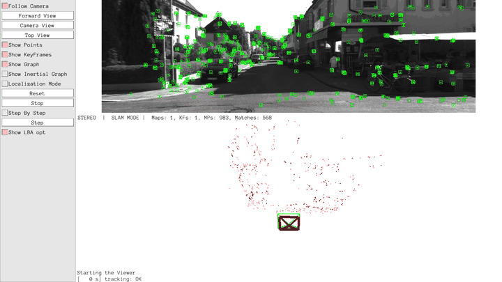
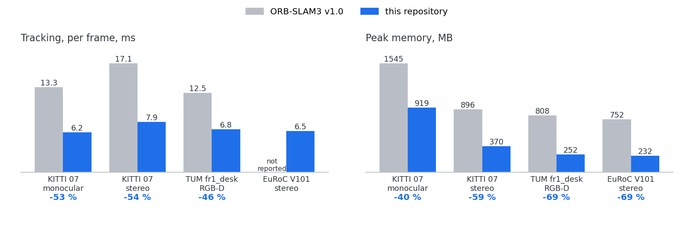

# ORB_SLAM3_Remastered

ORB-SLAM3 rebuilt for a robot's onboard computer: monocular, stereo and RGB-D
SLAM that tracks a frame in under half the time of ORB-SLAM3 v1.0 and runs
in a third of the memory -- 60 % in monocular -- at the same accuracy, with
the defects found on the way fixed and the code laid out along the
architecture of the paper.



## At a glance



| Run | Tracking per frame, ms | Peak memory, MB | ATE, m |
|---|---:|---:|---:|
| KITTI 07 monocular | 13.3 → **6.2** (-53 %) | 1545 → **919** (-40 %) | 2.13 → 2.71 |
| KITTI 07 stereo | 17.1 → **7.9** (-54 %) | 896 → **370** (-59 %) | 0.408 → 0.469 |
| TUM fr1_desk RGB-D | 12.5 → **6.8** (-46 %) | 808 → **252** (-69 %) | 0.018 → 0.018 |
| EuRoC V101 stereo | – → 6.5 | 752 → **232** (-69 %) | 0.037 → 0.037 |

v1.0 → now, medians of three runs of each, four runs sharing the machine
(linux/arm64 in Docker, Apple M-series). Accuracy moves from one run to the
next of the same binary by more than the two columns differ: KITTI 07 stereo
between 0.40 and 0.48 m, monocular between 2.0 and 4.5 (v1.0 between 2.1 and
4.5 as well).

**Place recognition** finds what is there to be found:

| Run | Loops closed | Maps merged | Tracking per frame, ms | ATE, m |
|---|---:|---:|---:|---:|
| KITTI 05 stereo (three loops) | 3 | – | 8.9 | 0.96 |
| KITTI 05 monocular | 3 | – | 6.6 | 5.55 |
| EuRoC V101 + V102 in one session, stereo | 3 | 1 | 6.7 | 0.037 |
| EuRoC V101 + V102 in one session, monocular | 1 | 1 | 6.2 | 0.029 |

One run of each. KITTI 05 monocular has ended between 4.3 and 7.4 m in the
runs of this tree, and between 5.6 and 7.8 in those of v1.0.

Both tables come from one command, which takes three minutes (five for the
second) and compares with what was last accepted:

```bash
./tools/check.sh            # speed, accuracy, memory: mono, stereo, RGB-D
./tools/check.sh robust     # loops and merges
```

## What was done

**Faster**

Per stage, KITTI 07, before this work and now, measured side by side
(`tools/ab_stages.sh`):

| Stage, ms | Stereo | Monocular |
|---|---:|---:|
| ORB extraction | 12.7 → **5.1** | 10.9 → **4.6** |
| Stereo matching | 2.8 → **0.9** | |
| Tracking, all of it, per frame | 19.3 → **10.9** | 14.5 → **8.9** |
| Creating map points, per keyframe | 7.6 → **5.4** | 23.0 → **15.3** |
| Local bundle adjustment | 17.1 → **13.6** | 61.5 → 64.1 |
| Culling keyframes | 0.8 → 0.7 | 8.6 → **5.0** |
| Local Mapping, all of it, per keyframe | 28.1 → **22.4** | 96.2 → **87.5** |

- **Extraction**: the levels of the image pyramid in parallel -- what is
  extracted does not depend on the number of threads
  (`ORBextractor.nThreads`); a descriptor's 512 sampling points rotated four
  at a time (SSE2 / NEON); FAST once over a level instead of once per cell,
  with a stronger corner across a cell's edge now suppressing a weaker one.
  9.8 → 3.6 ms an image on two threads, 6.4 on one.
- **Matching**: descriptors compared 64 bits at a time, inline, in every
  search; stereo matching sums its windows on the pixels instead of making a
  matrix for each.
- **Data structures**: a Frame's feature grid and a map point's observations
  are each one block instead of a heap block per cell and per observation, so
  that the copies every frame and every search make of them cost one copy.
- **Local bundle adjustment** had not converged after its ten iterations:
  g2o's initial damping is sized by a keyframe's rotation and holds the points
  back for six or seven of them. Started small, two iterations reach what ten
  did. In stereo and RGB-D; in monocular it cost accuracy and is as it was.
  KITTI 04 stereo: 47.5 → 36.4 ms.

**Smaller**

- The vocabulary tree is six arrays, 55 MB, where DBoW2 keeps 1.1 million
  node objects, 106 MB; the same words, loaded in 0.4 s instead of 1.9.
- A keyframe's words are one block of 32 KB instead of a std::map of 126 KB;
  its feature grid is flat; no duplicate keypoints. A keyframe of KITTI 07
  mono is 236 KB; it was 472 as v1.0 keeps it.
- MapPoints that were culled are freed once no thread can still be using them
  ([docs/OWNERSHIP.md](docs/OWNERSHIP.md)); v1.0 never frees one. A map
  point's observations are one block, not a node per observation, and the
  point itself is 0.44 KB, not 0.70.

**Defects of v1.0 that were fixed**

| Defect | Effect |
|---|---|
| `Sim3Solver` divided 0 by 0 for an identity rotation | the process aborted without a message, in about 3 % of runs |
| `DetectNBestCandidates` did not advance past a culled candidate | Loop Closing hung |
| `SearchForTriangulation` never marked a feature as taken | duplicate map points, observations a keyframe did not know of |
| The projection Jacobian kept a reference to a temporary | undefined behaviour in every pose optimisation |
| Two Frame copies leaked per frame after an inertial relocalisation | memory grew without bound |
| `UpdateLocalKeyFrames` iterated a vector it was growing | undefined behaviour |
| Threads were not joined at shutdown; trajectory savers read an uninitialised map | crashes on exit |
| `mnFullBAIdx` was declared `bool` and counted | the guard it feeds was dead after the first global BA |

**Maintainable**

- Sources in layers that follow Figure 1 of the paper: `atlas/`, `tracking/`,
  `local_mapping/`, `loop_closing/`, `optimization/`, and below them `camera/`,
  `features/`, `common/`. No include cycles; `tools/cycles.py` keeps it so.
- Dependencies are pinned upstream releases, untouched, in `thirdparty/`;
  ORB-SLAM3's changes to them are separate code in `vendor_ext/`
  ([docs/WRAPPERS.md](docs/WRAPPERS.md)).
- The three threads know each other through three interfaces
  (`common/ThreadPorts.hpp`): what Tracking asks of Local Mapping, what Local
  Mapping and Loop Closing ask of Tracking, what both ask of Loop Closing --
  not each other's classes. They start once they are wired; no thread reads
  another's members.
- Built and run in Docker only. `std::` written out, no `using namespace`.
- Tests in seven seconds (`ctest`), a benchmark of the extractor on its own
  (`tests/bench_orb`), and the two checks above.

## Quick start

```bash
git clone --recurse-submodules <this repo> ORB_SLAM3_Remastered
cd ORB_SLAM3_Remastered
./docker/build_images.sh                      # base -> thirdparty -> dev, ~10 min
tar -xzf reference/ORB_SLAM3/Vocabulary/ORBvoc.txt.tar.gz -C Vocabulary
./tools/build.sh                              # library, examples, tests
./tools/check.sh                              # needs the datasets under /datasets
./tools/monitor.sh kitti stereo 07            # watch a sequence, from macOS
```

Datasets are expected where `tools/dataset_plan.sh` says: EuRoC, KITTI
odometry and TUM RGB-D.

## Documentation

| | |
|---|---|
| [docs/MEASUREMENTS.md](docs/MEASUREMENTS.md) | what was measured and how: the dataset matrix, its reproducibility, every comparison against v1.0 |
| [docs/OWNERSHIP.md](docs/OWNERSHIP.md) | who owns a KeyFrame or a MapPoint, and how a culled one is freed |
| [docs/DEVELOPMENT.md](docs/DEVELOPMENT.md) | the Docker images, building, formatting, layout of the tree |
| [docs/VIEWER.md](docs/VIEWER.md) | watching the viewer live from macOS |
| [docs/DEPENDENCIES.md](docs/DEPENDENCIES.md), [docs/WRAPPERS.md](docs/WRAPPERS.md) | the borrowed libraries, and ORB-SLAM3's changes to them |
| [docs/PORTING.md](docs/PORTING.md), [docs/FRAME_KEYFRAME.md](docs/FRAME_KEYFRAME.md) | how the port was made; why Frame and KeyFrame share what they share |

## Known and open

- On TUM fr1_desk RGB-D, tracking is lost right after initialisation in about
  one run in ten and recovered by a second map that is merged later: v1.0 in 2
  runs of 12, this tree in 1 of 12.
- One run of TUM fr1_desk RGB-D in fourteen of one build ended at an ATE of
  0.140 m without losing tracking; not explained, and not seen since.
- Two of the first eleven runs of KITTI 07 stereo with the one-pass FAST
  ended at 0.55 and 0.86 m where forty runs before had all ended between
  0.39 and 0.49; sixteen runs of each side by side then showed no
  difference. Watched.
- Local bundle adjustment in monocular still runs with g2o's damping; half of
  what an adjustment costs besides is building the graph for g2o.
- Tracking the local map takes 0.1 to 0.4 ms longer per frame in stereo than
  before extraction was made parallel; not looked into.
- Culled KeyFrames are not freed (9.6 MB on KITTI 07 mono; worth it in the
  inertial configurations, which cull hundreds).
- Tracking and the viewer still call back into `System` (resets, saving a
  trajectory, localisation mode), which keeps the two in one cycle with it.

## License

ORB-SLAM3 is GPLv3; see [docs/DEPENDENCIES.md](docs/DEPENDENCIES.md) for the
license of every borrowed component.
